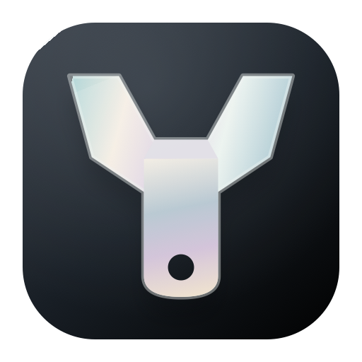
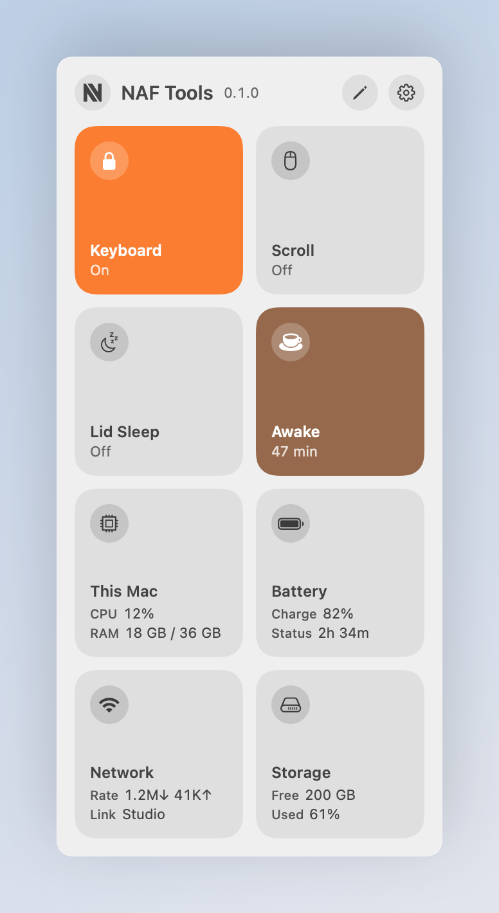
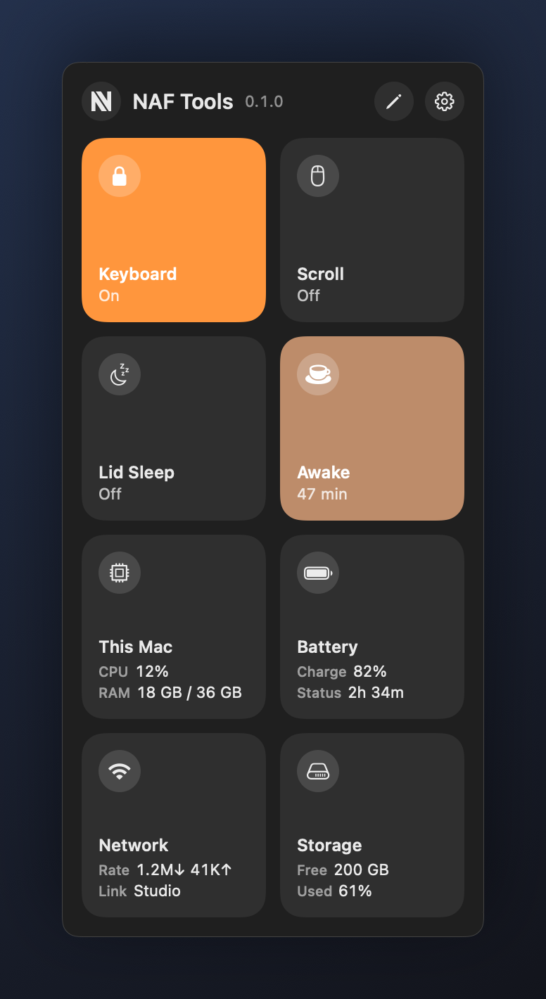
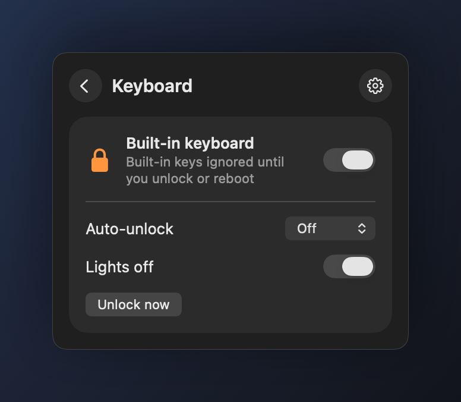
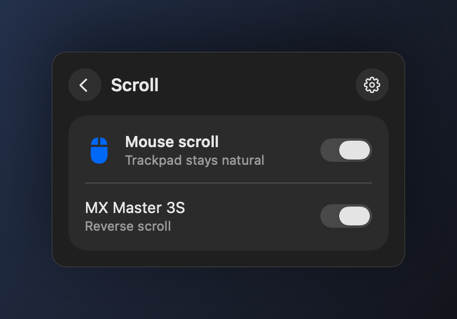
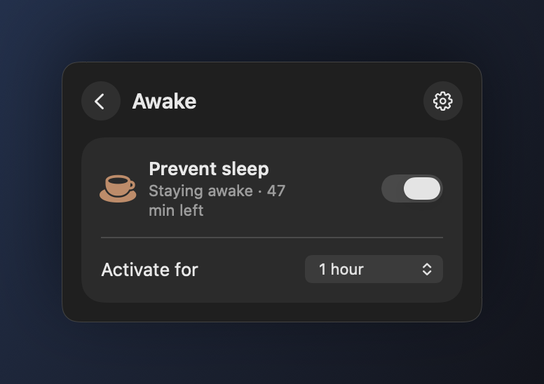
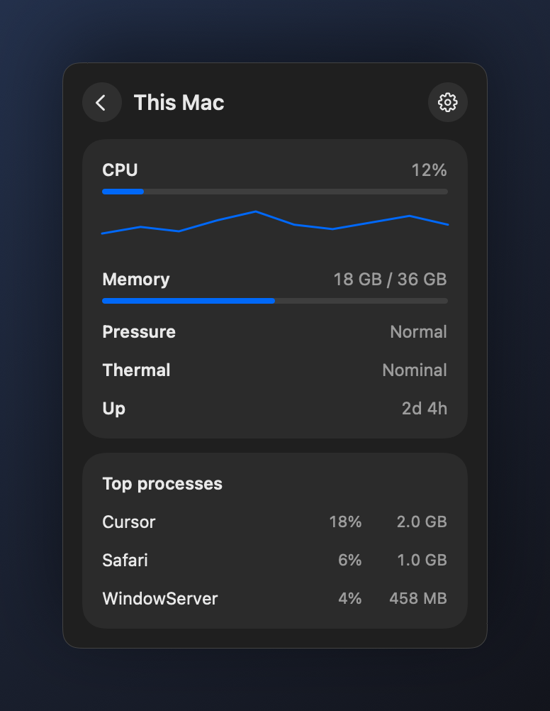
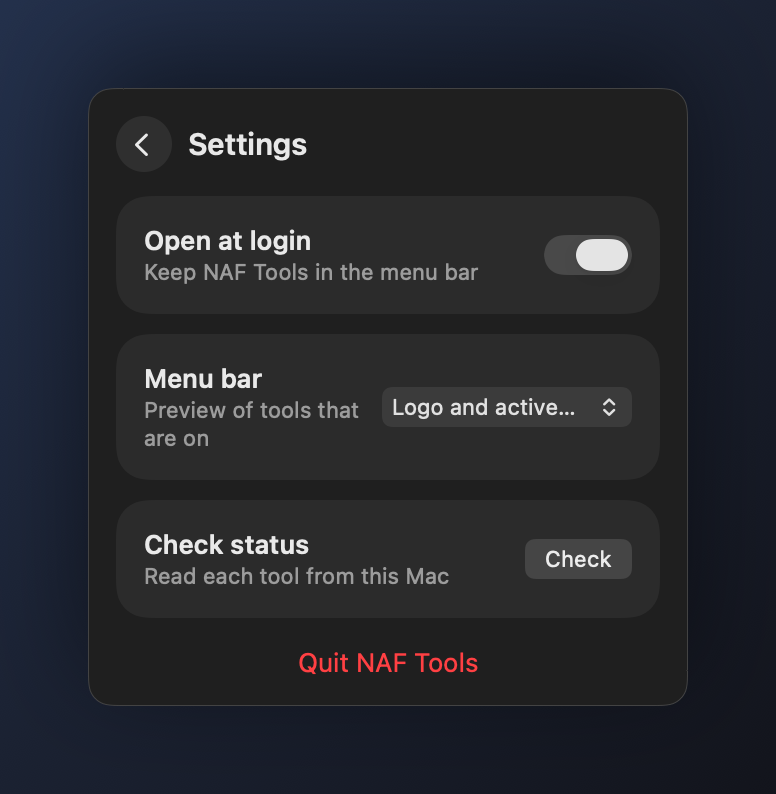

# NAF Tools

<p align="center">
  
</p>

<p align="center">
  <strong>A Control Center–style menu-bar widget for a few Mac utilities you actually reach for.</strong><br>
  It lives next to the clock, follows light and dark, and never takes a Dock icon.
</p>

<p align="center">
  
  
</p>

Click the **N** in the menu bar to open a 2-column grid of tiles. Each tile is one tool:

- Tap the **icon** to toggle it with the current options.
- Tap the **rest of the tile** for the detail screen.
- The **gear** opens Settings. Closing the popover always returns you home.

Active tiles fill with their color (orange keyboard, brown awake, and so on). Off tiles stay quiet. **This Mac** is informational only and shows live CPU and RAM while the panel is open.

## Keyboard lock

<p align="center">
  
</p>

Disables the MacBook’s **built-in keyboard** while the trackpad, any external keyboard, Touch ID, and the power button keep working.

Every HID keyboard usage on the internal keyboard is remapped to “no event” for the current boot (`hidutil` UserKeyMapping). A reboot or logout always restores the keys, so you cannot lock yourself out.

Optional **auto-unlock** after 5–60 minutes is a dead-man’s switch for wiping the keyboard down. **Lights off** dims the keyboard backlight while it is locked. Sleep/wake can drop the mapping; the app re-applies it if the lock was still on.

## Scroll reverse

<p align="center">
  
</p>

macOS has one system-wide Natural Scrolling switch. When this tool is on, **mouse wheel** (and Magic Mouse) scrolling is reversed so a mouse feels classic while the **trackpad stays natural**.

Each connected mouse can be switched independently. Requires **Accessibility** permission (System Settings → Privacy & Security → Accessibility). The panel will prompt if it is missing.

## Lid sleep

Keeps the Mac awake on **battery** when the lid is closed — the same `pmset` calls as:

```sh
sudo pmset -b sleep 0
sudo pmset -b disablesleep 1
```

Turning the tile Off restores battery sleep to 60 minutes and `disablesleep 0`.

The first toggle asks for an administrator password once. That installs a narrow `/etc/sudoers.d/naf-tools-lid-sleep` rule so later On/Off switches do not prompt. The flag is system-wide for battery power and stays until you turn it off; quitting the app does not restore sleep. A closed MacBook with nowhere to dump heat can get hot — switch it off when you are done.

## Awake

<p align="center">
  
</p>

Prevents idle sleep and display sleep — the same job as KeepingYouAwake, using macOS’s built-in `caffeinate`:

```sh
caffeinate -di
caffeinate -di -t 3600   # one hour
```

Turn the tile On to hold sleep indefinitely, or pick a duration first (5 minutes through 5 hours). When a timer is running, the tile shows time left. Changing the duration while On restarts the timer. The hold is a detached `caffeinate` process, so quitting the menu-bar app does not drop it. Turn the tile (or `naf-tools awake off`) off when you are done.

Lid Sleep is separate: that keeps the Mac awake with the **lid closed** on battery. Awake only blocks idle sleep while the lid is open.

## This Mac

<p align="center">
  
</p>

Live CPU and memory, sampled only while the popover is open. The home tile shows the same numbers in compact form.

## Settings

<p align="center">
  
</p>

- **Open at login** — keep NAF Tools in the menu bar (on by default).
- **Menu bar** — logo only, icons for tools that are on, or both. When nothing is on, the logo stays so you can still find the app.
- **Check status** — read each tool from this Mac and restore anything that dropped (sleep can clear a keyboard mapping; Accessibility can disable the scroll tap).

Right-click the menu-bar item for the same toggles without opening the panel.

## Terminal / agents

`./build.sh` also installs a `naf-tools` CLI (symlinked to `~/.local/bin/naf-tools`) that drives the same tools without opening the panel. Add `~/.local/bin` to `PATH` if it is not there already.

```sh
naf-tools status --json
naf-tools keyboard on --minutes 15
naf-tools scroll on
naf-tools lid off
naf-tools awake on --minutes 60
naf-tools mac
```

Every command accepts `--json`. Exit codes: `0` ok, `1` failed, `2` usage, `3` permission (Accessibility or administrator). `naf-tools --help` is the full contract.

## Persistence

Each tool remembers the last On/Off you chose. Opening the app again restores that choice:

- **Keyboard lock** is re-applied for the rest of this boot. A reboot always unlocks the keys (so you cannot lock yourself out). Auto-unlock, if set, keeps running after Quit.
- **Scroll reverse** is a helper process (`naf-tools-scroll`) shared by the app and the CLI. It keeps running after Quit until you turn Scroll off.
- **Lid sleep** lives in `pmset`. The tile reads the real setting on launch.
- **Awake** is a detached `caffeinate` process shared by the app and the CLI. It keeps running after Quit until the timer ends or you turn it off.

## Install

```sh
./build.sh
open ~/Applications/NAF\ Tools.app
```

Look for the N logo in the menu bar. Drag the icon leftward if macOS tucks it behind the extra-items chevron.

The CLI is installed at `~/.local/bin/naf-tools`. Add that directory to `PATH` if needed.

The first build is signed with a local identity. If Gatekeeper blocks it, right-click the app → Open.

macOS 14 or later.

## Notes

- Keyboard lock needs no extra permission.
- Awake needs no extra permission (`caffeinate`).
- Scroll reverse needs Accessibility because it installs a session event tap.
- Lid sleep asks for an administrator password once, then toggles without prompting.
- Open at login can be turned off from Settings.
