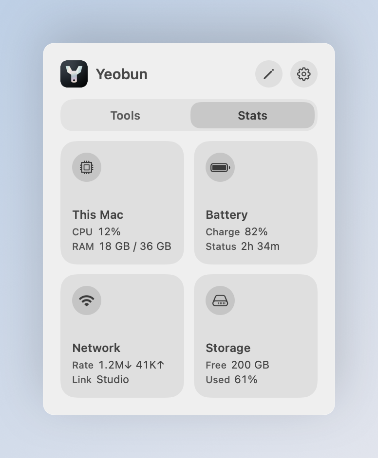
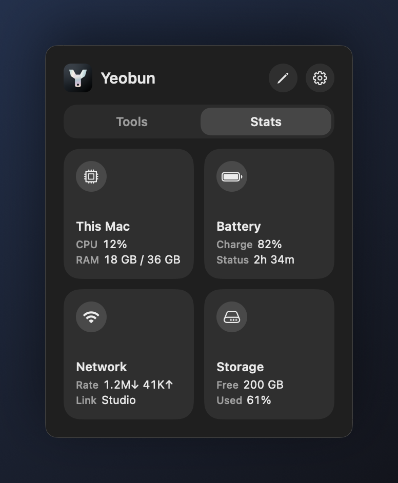
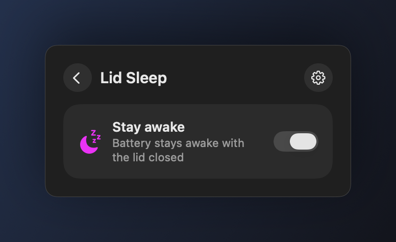
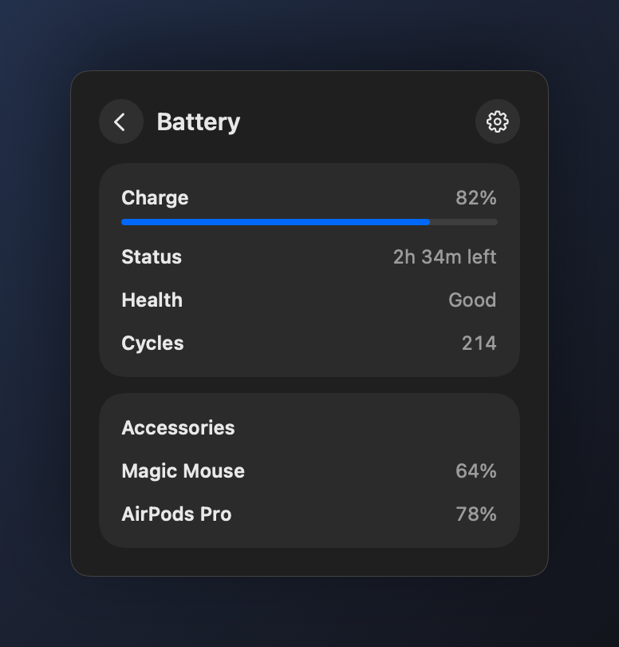
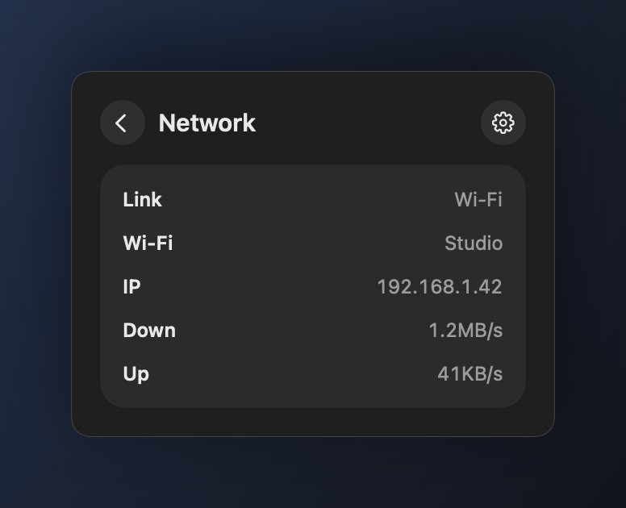
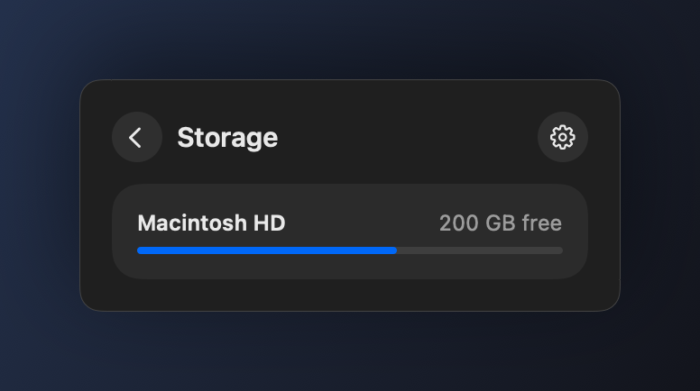

# Yeobun

<p align="center">
  
</p>

<p align="center">N6 Studio</p>

<p align="center">
  <strong>A Control Center–style panel in the menu bar for the extras macOS did not ship. No Dock icon.</strong><br>
  Lock the built-in keyboard. Reverse mouse scroll. Stay awake with the lid closed. Prevent idle sleep. Glance at this Mac.
</p>

<p align="center"><em>Yeobun</em> is from Korean <strong>여분</strong>: spare, extra.</p>

<p align="center">
  
  
</p>
<p align="center">
  
  
</p>

Click the wrench to open a two-column grid. **Tools** and **Stats** are tabs; the last one you used is remembered. Click a tile’s **icon** to toggle it. Click the rest of the tile for options. The **gear** opens Settings.

## Install

Homebrew:

```sh
brew install --cask n6-studio/tap/yeobun
```

Or tap first, then install:

```sh
brew tap n6-studio/tap
brew trust --tap n6-studio/tap
brew install --cask yeobun
```

Homebrew 6 asks you to trust `n6-studio/tap` the first time. The one-line install trusts only this cask.

Or download the disk image from the [latest GitHub release](https://github.com/n6-studio/yeobun/releases/latest) and drag **Yeobun** onto **Applications**. Open it, then look for the wrench in the menu bar. Drag the icon left if macOS tucks it behind the extra-items chevron.

If Gatekeeper blocks it, right-click the app → Open. The release is signed locally, not notarized.

Requires macOS 14 or later.

## Tools

Active tiles fill with their color.

### Keyboard

<p align="center">
  
</p>

Disables the MacBook’s **built-in keyboard**. The trackpad, any external keyboard, Touch ID, and the power button keep working. A reboot always unlocks the keys.

Optional **auto-unlock** after 5–60 minutes is for wiping the keyboard down. **Lights off** dims the backlight while it is locked.

### Scroll

<p align="center">
  
</p>

Reverses **mouse wheel** scrolling so a mouse feels classic while the **trackpad stays natural**. Each mouse can be switched on its own. Needs Accessibility permission; the panel will ask if it is missing.

### Lid Sleep

<p align="center">
  
</p>

Keeps the Mac awake on **battery** when the lid is closed. The first toggle asks for an administrator password once; later switches do not. The setting stays until you turn it off — quitting the app does not restore sleep.

A closed MacBook with nowhere to dump heat can get hot. Switch it off when you are done.

### Awake

<p align="center">
  
</p>

Prevents idle sleep and display sleep. Turn it on indefinitely, or pick a duration first (5 minutes through 5 hours). The tile shows time left. Quitting the app does not drop the hold.

Lid Sleep is the closed-lid case. Awake only blocks idle sleep while the lid is open.

## Stats

Informational only. Sampled while the panel is open, and in the menu bar if you turn on a glance.

<p align="center">
  
  
</p>
<p align="center">
  
  
</p>

- **This Mac** — live CPU and RAM on the tile; detail adds pressure, swap, thermal state, uptime, and the top processes.
- **Battery** — charge, time remaining, health, and cycle count. Bluetooth accessories when macOS reports a percentage. On a desktop the tile reads “Desktop”.
- **Network** — link type, Wi-Fi name when macOS allows it, local IP, live down/up.
- **Storage** — used and free space on the boot volume, plus other mounted disks.

## Settings

<p align="center">
  
</p>

- **Open at login** — keep Yeobun in the menu bar (on by default).
- **Menu bar** — logo only, icons for tools that are on, or both. The logo stays when nothing is on, so you can still find the app.
- **Menu bar stats** — optional CPU, battery, or network next to the logo.
- **Check status** — re-read each tool from this Mac and restore anything that dropped.

Right-click the menu-bar item for the same toggles without opening the panel.

## CLI

`./build.sh` also installs `yeobun` at `~/.local/bin/yeobun`. After a disk-image install, the same binary lives at `/Applications/Yeobun.app/Contents/MacOS/yeobun-cli`. Add `~/.local/bin` to `PATH` if it is not there already.

```sh
yeobun status --json
yeobun keyboard on --minutes 15
yeobun scroll on
yeobun lid off
yeobun awake on --minutes 60
yeobun mac
```

Every command accepts `--json`. Exit codes: `0` ok, `1` failed, `2` usage, `3` permission. `yeobun --help` is the full contract.

## From source

```sh
./build.sh
open ~/Applications/Yeobun.app
```

## Notes

- Keyboard lock and Awake need no extra permission.
- Scroll reverse needs Accessibility.
- Lid Sleep asks for an administrator password once.
- Keyboard lock lasts until you unlock or reboot. Sleep can drop the mapping; the app re-applies it if the lock was still on. Scroll reverse and Awake keep running after Quit until you turn them off. Lid Sleep stays until you turn it off.
